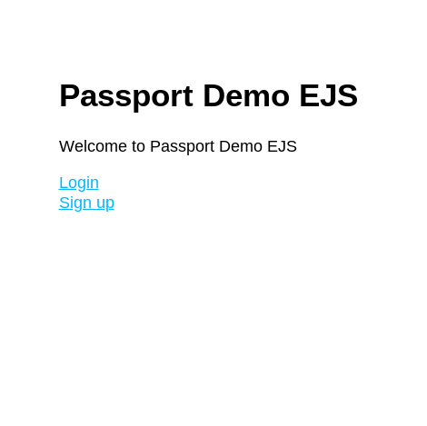
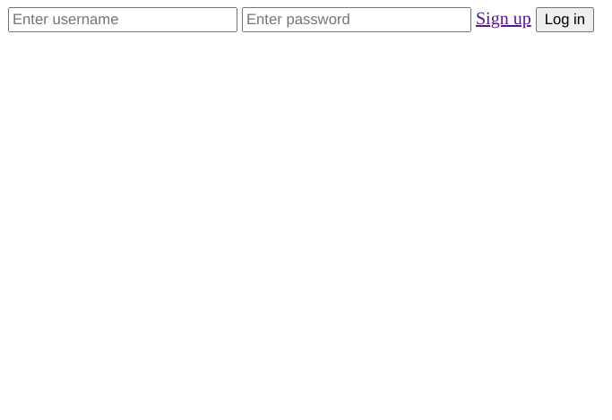
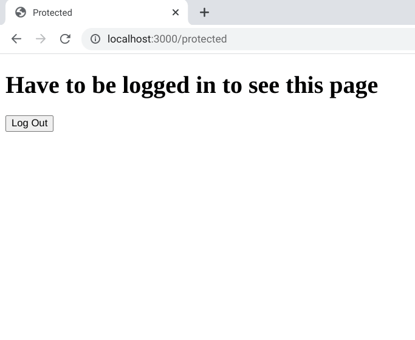

# Passport Demo EJS

## Table of contents

- [Overview](#overview)
  - [Screenshot](#screenshot)
  - [Built With](#built-with)
- [Useful Resources](#useful-resources)

## Overview

This is a session-based authentication example with passport.  This example uses mongo-connect to store sessions on the mongo database.  

### Screenshot

### Built with

- bcryptjs
- connect-mongo
- ejs
- express
- express-session
- mongoose
- passport
- passport-local

## Useful Resources

- [YouTube](https://www.youtube.com/watch?v=vsMpfm3RyUE) - mongo atlas changed
- [YouTube](https://www.youtube.com/watch?v=zrXBT2WPS94&list=PL62km_yqC3ZHlvkKVmR2f3W6SEzh8pRIf&index=4) - passport tutorial series
- [Mongo](https://www.mongodb.com/docs/atlas/driver-connection/) - atlas driver connection
- [Stack Overflow](https://stackoverflow.com/questions/72336177/error-reqlogout-requires-a-callback-function) - logout is now asynch
- [Github](https://github.com/jwalton/passport-api-docs) - passport api docs 
- [Medium](https://medium.com/passportjs/fixing-session-fixation-b2b68619c51d) - passport 0.6.0
- [OWASP](https://owasp.org/www-community/attacks/Session_fixation) - session fixation
- [Stack Overflow](https://stackoverflow.com/questions/33112299/how-to-delete-cookie-on-logout-in-express-passport-js) - delete cookie on logout
- [Tab Nine](https://www.tabnine.com/code/javascript/functions/express/Response/clearCookie) - clear cookie
- [NPM](https://www.npmjs.com/package/express-session) - express session
- [Stack Overflow](https://stackoverflow.com/questions/54674387/how-do-nodes-bcrypt-and-bcryptjs-libraries-differ) - probably should have used bcrypt instead
